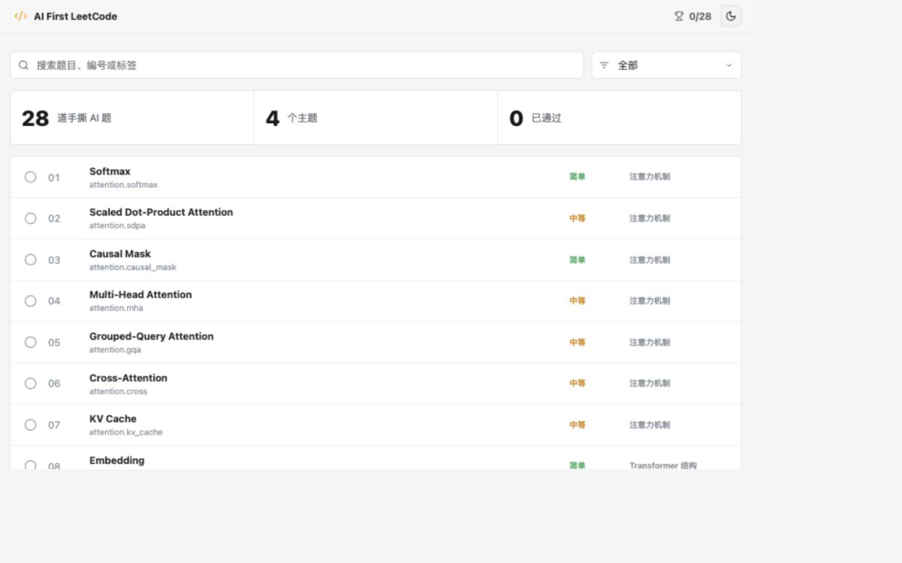
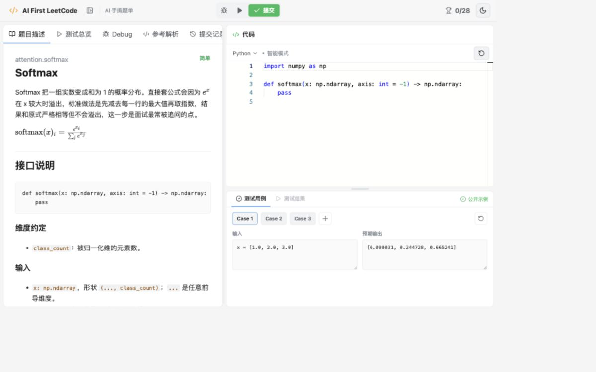
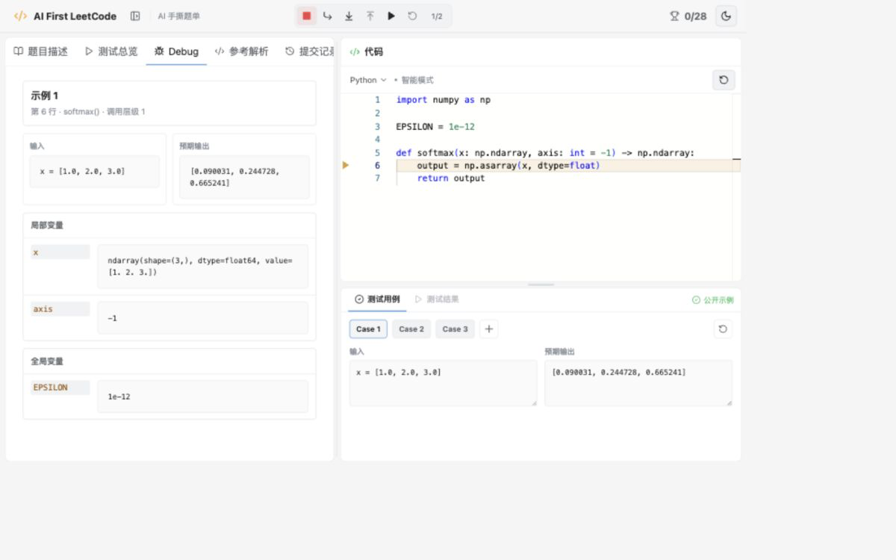

<div align="center">

# AI First LeetCode

**在本地，用 LeetCode 的方式真正手写 AI 核心算法。**

从 Softmax、Attention 到 Transformer、归一化与向量距离：28 道题，560 个确定性校验用例，一套可运行、可提交、可断点调试的沉浸式刷题工作台。

[](https://react.dev/)
[](https://www.typescriptlang.org/)
[](https://www.python.org/)
[](https://pytorch.org/)
[](#题目覆盖)
[](LICENSE)

</div>



## 为什么做这个项目

读懂公式并不等于能够在面试里写出来。AI First LeetCode 把常见的 AI 手撕题整理成一条完整练习链路：先读清接口、类型和维度，再从 `pass` 开始实现，最后用公开示例、边界用例和确定性校验验证答案。

它不是一组散落的 Notebook，也不是只能查看答案的文档，而是一个专注于 AI 算法的本地在线判题与调试环境。

## 核心体验

- **28 道 AI 高频手撕题**：覆盖注意力机制、Transformer 结构、归一化与激活、向量相似度与距离。
- **LeetCode 风格工作台**：题面、Monaco 编辑器、测试区三栏协作，题面和测试区分隔栏均可拖动并记忆位置。
- **题面即规范**：每题明确标注输入输出类型、完整维度语义，并提供 3 个带计算解释的公开示例。
- **运行与提交分离**：运行当前可见测试用例；提交执行该题 20 个确定性校验用例，包括零值、常量、大数、退化维度等边界情况。
- **Python 断点调试**：支持断点、重新开始、单步进入、单步跳过、跳出函数和继续运行，同时查看当前执行行、调用层级、局部变量与全局变量。
- **测试用例可编辑**：可以添加、删除、重置用例；错误提交可一键加入测试用例继续复现。
- **提交记录可追溯**：保存每次结果、耗时、通过数和代码快照，随时回看失败现场。
- **本地状态持久化**：自动保留代码草稿、通过状态、主题、断点、测试用例和分栏布局。
- **独立题目链接**：每道题都有稳定 URL，可收藏或直接打开指定题目。
- **亮色 / 暗色主题**：适配不同使用环境，切换后自动记忆。

## 工作台



### 一边写，一边看清程序如何运行

调试器不是一个简单的错误弹窗。它会把 Python 执行轨迹映射回编辑器，并将输入、预期输出、局部变量与全局变量并排展示。



## 题目覆盖

| 专题 | 数量 | 代表题目 |
| --- | ---: | --- |
| 注意力机制 | 7 | Softmax、Scaled Dot-Product Attention、Causal Mask、MHA、GQA、Cross-Attention、KV Cache |
| Transformer 结构 | 7 | Embedding、Positional Encoding、RoPE、SwiGLU、Encoder / Decoder Block |
| 归一化与激活 | 10 | LayerNorm、RMSNorm、BatchNorm、GroupNorm、ReLU、GELU、SiLU、Min-Max Normalize |
| 向量相似度与距离 | 4 | Cosine Similarity、Euclidean Distance、Manhattan Distance、KL Divergence |
| **合计** | **28** | **每题 3 个公开示例 + 20 个提交校验用例** |

## 快速开始

### 环境要求

- Node.js 18+
- Python 3.10+
- NumPy 1.26+
- PyTorch 2.2+

### 安装

```bash
git clone https://github.com/lumole/ai-first-leetcode.git
cd ai-first-leetcode

npm install
python3 -m pip install -r requirements.txt
```

如果使用 Conda：

```bash
conda create -n ai-first-leetcode python=3.12 -y
conda activate ai-first-leetcode
python -m pip install -r requirements.txt
```

### 一键启动

```bash
npm run app:start
```

打开 [http://127.0.0.1:5173/](http://127.0.0.1:5173/)。停止、重启和查看状态：

```bash
npm run app:stop
npm run app:restart
npm run app:status
```

macOS 还可以直接双击仓库根目录中的 `Start AI First LeetCode.app` 和 `Stop AI First LeetCode.app`，静默启动或停止服务。

> 启动脚本会优先使用 `AI_FIRST_PYTHON` 指定的解释器，然后查找常见 Conda 环境，最后回退到 `python3`。

## 工作原理

```text
Markdown 题库
    │
    ▼
Python 判题服务 ── 公开示例 / 20 个确定性校验 / 调试轨迹
    │
    ▼
React + TypeScript ── Monaco 编辑器 / 题面 / 测试区 / 提交历史
```

- `server.py`：题目接口、代码执行、判题与调试轨迹采集。
- `contracts.py`：28 道题的函数签名、类型和维度约定。
- `problems/`：项目自带的 Markdown 题目源文件。
- `src/`：React 工作台、状态管理和 LeetCode 风格界面。

用户代码会在本机 Python 子进程中执行。本项目面向可信用户的本地学习环境，不应将判题端口直接暴露到公网，也不应将它作为多租户沙箱使用。

## 开发

```bash
# 前端开发服务器
npm run dev

# 判题服务
python3 server.py --port 8000

# 生产构建检查
npm run build
```

## Roadmap

- [ ] 增加更多 LLM、扩散模型与训练工程题目
- [ ] 增加题目收藏、错题本和复习计划
- [ ] 增加更细粒度的性能与内存反馈
- [ ] 支持导入自定义 Markdown 题库

欢迎提交 Issue 或 Pull Request：新题目、极端测试用例、题面解释和交互改进都很有价值。

## 致谢

- 界面与交互思路参考 [LeetCode](https://leetcode.com/) / [力扣](https://leetcode.cn/)。本项目与 LeetCode 官方无关联。
- 初始项目思路参考 [LLMleetcode](https://github.com/yhwlp0711/LLMleetcode)。
- 编辑器由 [Monaco Editor](https://microsoft.github.io/monaco-editor/) 提供。

## License

[MIT](LICENSE)

<div align="center">

如果这个项目让 AI 手撕题不再停留在“看懂了”，欢迎点一个 Star，让更多人一起把核心算法真正写出来。

</div>
